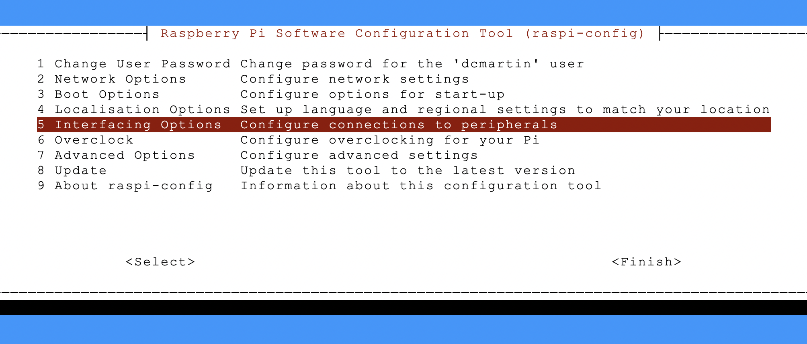
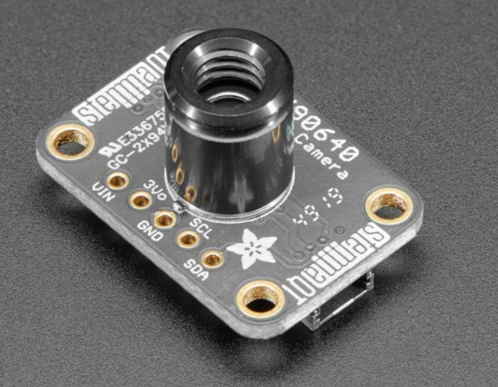
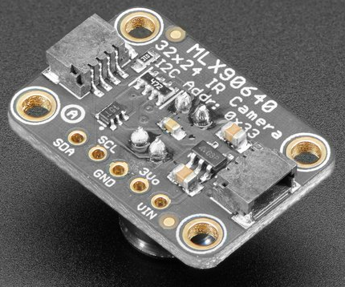
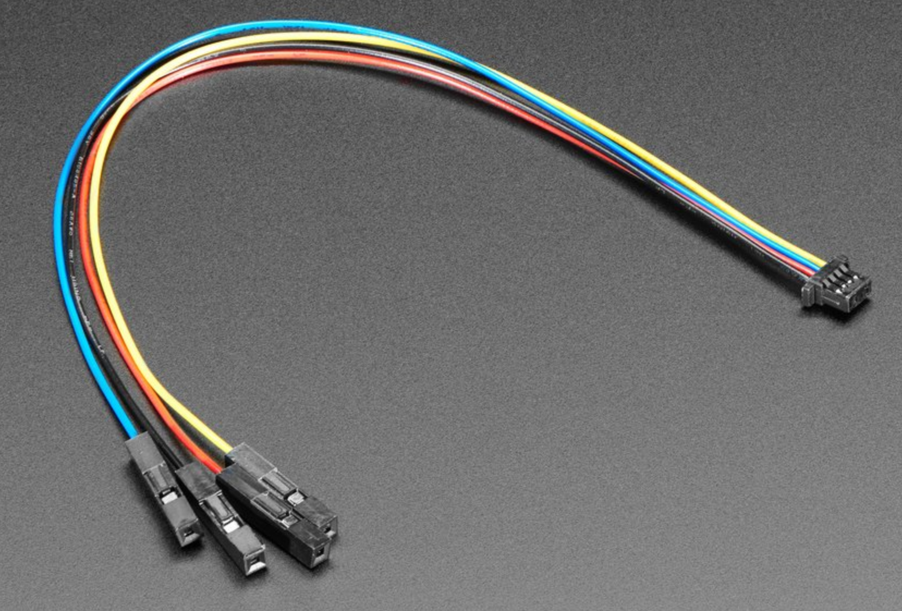
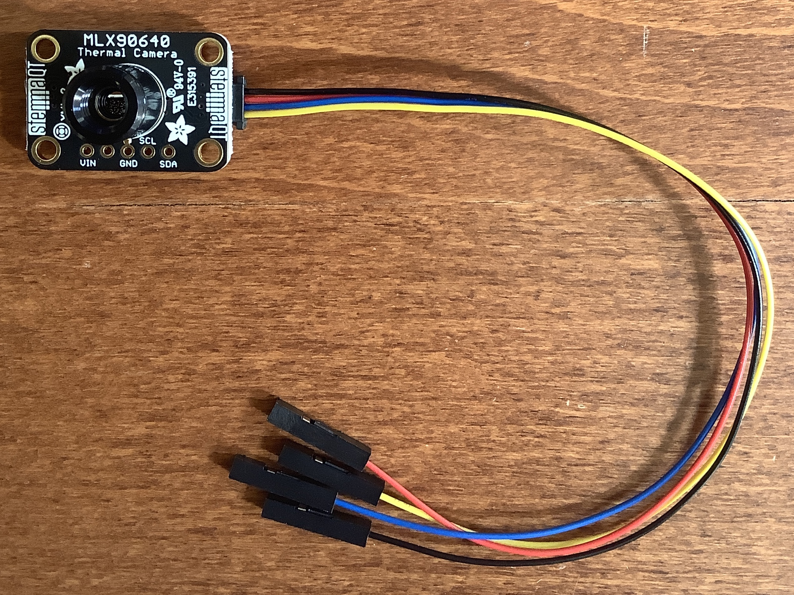
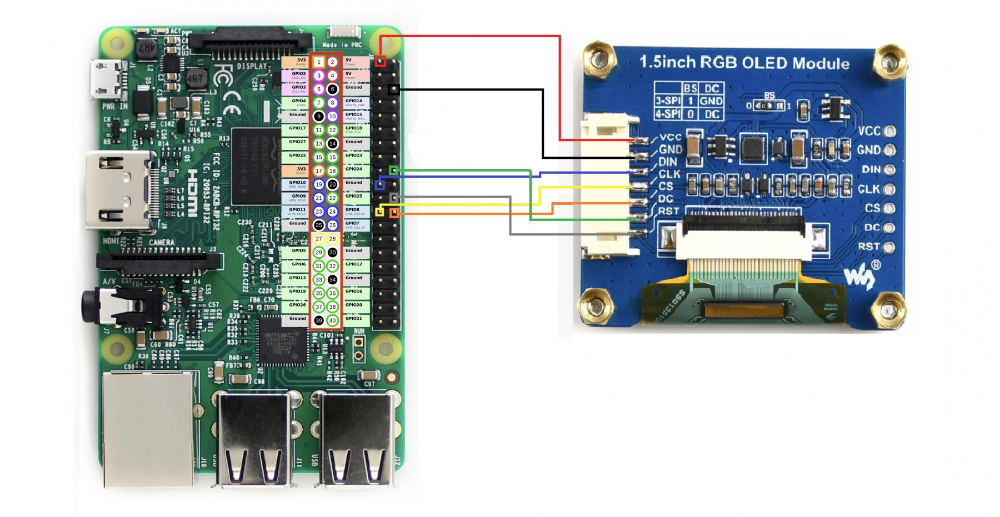
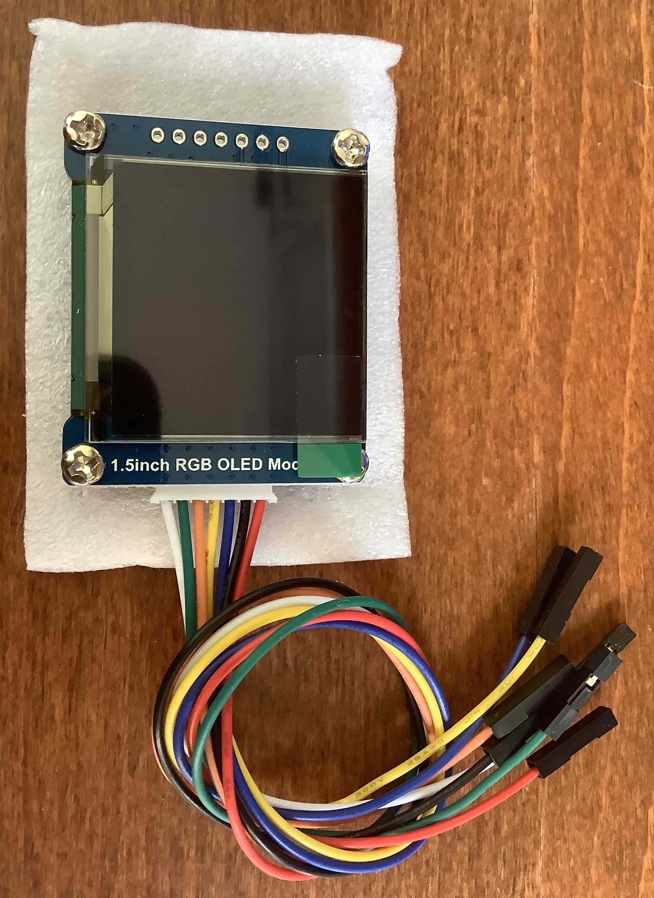
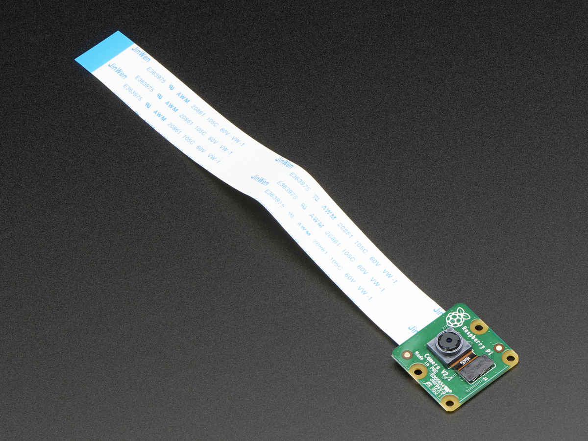
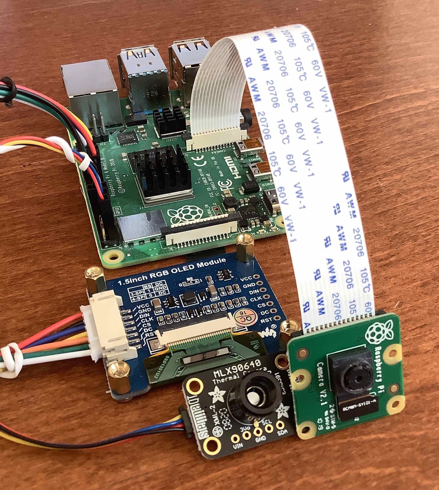

# &#x1F321; - `feeva`
Perform facial detection and provide thermal measurement for humans.

2. Use `raspi-config` to enable `I2C` interface
6. Connect display, camera, and thermal sensor
3. Install `docker` and `git`
4. Clone this repository
5. Change directory and run `make`

# &#128679; `UNDER CONSTRUCTION` &#128679;

## Parts

+ RaspberryPi Model 3/4
+ 1.5" RGB [OLED module](http://www.waveshare.net/wiki/1.5inch_RGB_OLED_Module); 3-pack at [Amazon](https://www.amazon.com/gp/product/B07DBXMFSN/ref=ppx_yo_dt_b_asin_title_o02_s00?ie=UTF8&psc=1)
+ `v2` [camera module](https://www.adafruit.com/product/3099)
+ `MLX90640` [IR thermal camera](https://www.adafruit.com/product/4407)
+ `STEMMA` [cable](https://www.adafruit.com/product/4397)


## Step 1 - Enable `I2C` interface
The serial connection may need to be enabled; use the `raspi-config` command-line program; for example:

```
% sudo raspi-config
```

A terminal-based interface will launch and provide menu options to enable the `I2C` interface; for example:



## Step 2 - Connect thermal sensor
The thermal sensor has standard `GPIO` labeled connections as well as small receivers on either side of the board.

<a href="https://www.adafruit.com/product/4407">


</a>

The thermal sensor connects to the `GPIO` pins on the RaspberryPi using a `STEMMA` cable.


<a href="https://www.adafruit.com/product/4397">

</a>

This cable connects to the RaspberryPi using four (4) GPIO pins; the recommended connections are:



Raspberry Pi|PIN|Color|Termal|
---|---|---|---|
3.3V current|1|RED|`VCC`
Serial data|3|BLUE|`SDA`
Serial clock|5|YELLOW|`SCL`
Ground|9|BLACK|`GND`

##  Step 3 - Connect OLED display connection
The OLED display connects to the `GPIO` pins on the RaspberryPi using the provided cable which attaches the side of the OLED display; see below.



The manufacturer provided diagram below indicates the **RED** cable be attached to _PIN 1_ and the **BLACK** cable to _PIN 6_; to connect the thermal sensor alternatives are recommended; see table below.



### `GPIO` connections

Raspberry Pi|PIN|Color|RGB OLED|
---|---|---|---|
3.3V current|17|RED|`VCC`|	
Ground|20|BLACK|`GND`|
`MOSI`|18|BLUE|`DIN`|	
`SCLK`|19|YELLOW|`CLK`|	
`CE0`|24|ORANGE|`CS`|	
`GPIO24`|18|GREEN|`DC`|
`GPIO25`|22|GRAY|`RST`|	


## Step 4 - Connect V2 camera module
Install the Raspberry Pi Camera module by inserting the cable into the Raspberry Pi.



The cable slots into the connector situated between the Ethernet and HDMI ports, with the silver connectors facing the HDMI port.


## &#9989; - Assembly complete



## Step 5 - Install software
Setup a RaspberryPi 3/4 with Raspbian `Buster` and access using `ssh` over the WiFi or wired Ethernet connection; once connected, run the following commands:

```
# appropriate for older devices which may need firmware upgrade
sudo rpi-update 
# enable I2C interface
sudo raspi-config
# update and upgrade everything
sudo apt update -qq -y
sudo apt full-upgrade -qq -y
# install minimal tooling
sudo apt install -qq -y git curl jq make
# install docker
curl -fsSL https://get.docker.com -o get-docker.sh
chmod 755 get-docker.sh
sudo ./get-docker.sh
# create local repository clone
mkdir -p ~/GIT/feeva
cd ~/GIT
git clone http://github.com/dcmartin/feevat.git
# build it
cd ~/GIT/feeva
make
# start it
make start
```

#  Further Information 

## RaspberryPi `GPIO` reference


# Changelog & Releases

Releases are based on Semantic Versioning, and use the format
of ``MAJOR.MINOR.PATCH``. In a nutshell, the version will be incremented
based on the following:

- ``MAJOR``: Incompatible or major changes.
- ``MINOR``: Backwards-compatible new features and enhancements.
- ``PATCH``: Backwards-compatible bugfixes and package updates.

## Authors & contributors

David C Martin (github@dcmartin.com)
## Stargazers
[](https://starchart.cc/dcmartin/feeva)


